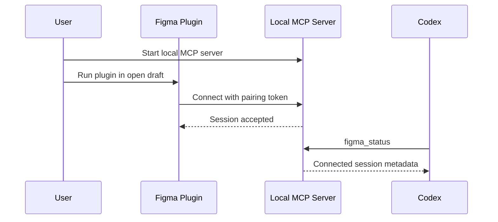
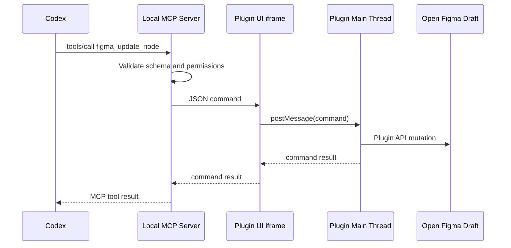

# Architecture: Local Figma MCP Bridge

## 1. Architecture Summary

The system is a local bridge between Codex and an open Figma draft. Codex talks to a local MCP server using a standard MCP transport. The MCP server talks to a Figma plugin client over localhost. The plugin applies commands to the currently open Figma document through the Figma Plugin API.

```text
Codex
  <-> Local MCP Server
      - stdio or Streamable HTTP MCP transport
      - tool registry
      - command validation
      - session and pairing state
    <-> Local Bridge Channel
        - WebSocket or local HTTP
        - JSON command/response protocol
      <-> Figma Plugin UI iframe
          - browser APIs
          - localhost connection
        <-> Figma Plugin Main Thread
            - Figma scene access
            - Plugin API command executor
```

## 2. Component Responsibilities

### 2.1 MCP Server

Responsibilities:

- Implement MCP server lifecycle and tool discovery.
- Expose Figma-specific tools to Codex.
- Validate tool inputs with schemas.
- Maintain connected plugin sessions.
- Route commands to the active Figma plugin session.
- Enforce local security policy.
- Normalize plugin responses into MCP tool results.

Recommended implementation:

- TypeScript on Node.js for cross-platform support.
- MCP SDK for standard server behavior.
- `ws` or equivalent for local plugin bridge.
- `zod` or JSON Schema for command validation.

### 2.2 Local Bridge Channel

Responsibilities:

- Provide bidirectional communication between server and plugin.
- Carry command requests, command responses, events, logs, and heartbeat messages.
- Reconnect cleanly after plugin or server restart.

Recommended transport:

- WebSocket on `ws://127.0.0.1:<port>/figma`.
- HTTP fallback can be added later if plugin WebSocket behavior becomes unreliable.

### 2.3 Figma Plugin UI iframe

Responsibilities:

- Use browser networking APIs to connect to the local bridge.
- Display connection state and pairing status.
- Relay commands between the bridge and plugin main thread.
- Keep a minimal visible UI so the user knows the bridge is active.

The iframe cannot directly edit the Figma document. It must forward edit requests to the main thread.

### 2.4 Figma Plugin Main Thread

Responsibilities:

- Access the Figma document tree through `figma`.
- Execute validated command DSL operations.
- Load fonts and pages when required.
- Serialize node results into bounded JSON.
- Report errors with command IDs and target IDs.
- Group operations into undo-friendly units where possible.
- Avoid relying on private-plugin-only fields such as `figma.fileKey` for the MVP.

The main thread should not open arbitrary network connections. Browser APIs live in the UI iframe.

## 3. Data Flow

### 3.1 Pairing Flow



### 3.2 Command Flow



## 4. MCP Tool Surface

Initial tools:

- `figma_status`
- `figma_get_selection`
- `figma_read_node`
- `figma_read_tree`
- `figma_create_node`
- `figma_update_node`
- `figma_delete_node`
- `figma_batch`

Tool design rules:

- Every tool input must have a strict schema.
- Every mutation must include enough target information to audit the action.
- Every response must include `ok`, `commandId`, and either `result` or `error`.
- Tree reads must support `maxDepth`, `maxChildren`, and `includeHidden`.
- Batch operations must return per-operation results.

## 5. Command Protocol

Example command envelope:

```json
{
  "id": "cmd_01",
  "type": "updateNode",
  "target": {
    "nodeId": "123:456"
  },
  "payload": {
    "name": "Primary CTA",
    "x": 120,
    "y": 80
  },
  "options": {
    "dryRun": false
  }
}
```

Example response envelope:

```json
{
  "id": "cmd_01",
  "ok": true,
  "result": {
    "nodeId": "123:456",
    "type": "TEXT",
    "name": "Primary CTA"
  }
}
```

Error response:

```json
{
  "id": "cmd_01",
  "ok": false,
  "error": {
    "code": "NODE_NOT_FOUND",
    "message": "No node exists for id 123:456"
  }
}
```

## 6. Security Model

Required controls:

- Bind local server to `127.0.0.1`, not `0.0.0.0`.
- Validate `Origin` for HTTP/WebSocket connections where available.
- Require a random pairing token per server session.
- Reject unpaired plugin clients.
- Reject commands that do not match the DSL schema.
- Avoid raw JavaScript execution as the default mechanism.
- Log mutations locally with command ID, operation type, and target node ID.
- Keep external network access out of MVP.

This follows the MCP local server guidance to protect local HTTP transports from DNS rebinding and unintended remote access.

## 7. Figma Manifest Requirements

The plugin manifest must declare dynamic document access and localhost network access.

Example:

```json
{
  "name": "Local Codex Figma Bridge",
  "api": "1.0.0",
  "editorType": ["figma"],
  "main": "code.js",
  "ui": "ui.html",
  "documentAccess": "dynamic-page",
  "networkAccess": {
    "allowedDomains": [
      "ws://localhost:3846",
      "http://localhost:3846",
      "ws://127.0.0.1:3846",
      "http://127.0.0.1:3846"
    ],
    "reasoning": "Connects to a local MCP bridge controlled by the user."
  }
}
```

The exact port should be configurable. During development, `devAllowedDomains` can be used, but a local bridge meant for private use may keep explicit localhost entries in `allowedDomains`.

## 8. Cross-Platform Strategy

The server should avoid OS-specific APIs in the MVP.

Supported runtime:

- Node.js LTS on macOS and Windows.
- npm/pnpm scripts for build and start.
- No shell-specific startup requirement.
- File paths handled through Node `path`.
- Localhost networking only.

Figma plugin code should be bundled into plain JavaScript and HTML so it can be loaded through Figma's plugin development workflow on both macOS and Windows.

## 9. Reliability Strategy

- Heartbeat from plugin to server every few seconds.
- Server marks session disconnected after missed heartbeats.
- Commands include timeouts.
- Plugin returns explicit errors for unloaded pages, missing fonts, invalid nodes, and unsupported node types.
- Read operations are bounded.
- Mutations are small and composable.
- Batch execution should stop on first error by default, with an option to continue.

## 10. Implementation Phases

### Phase 1: Spike

- Build minimal MCP server.
- Build minimal Figma plugin.
- Establish localhost connection.
- Implement `figma_status` and `figma_get_selection`.

### Phase 2: Basic CRUD

- Implement read node/tree.
- Implement create rectangle/frame/text.
- Implement update name, position, size, fills, text.
- Implement delete node.
- Add command logs and error normalization.

### Phase 3: Safer Batches

- Add `figma_batch`.
- Add dry-run where feasible.
- Add size/depth limits.
- Add undo grouping and operation summaries.

### Phase 4: Rich Figma Support

- Add auto layout support.
- Add component and variant support.
- Add variables/styles where Plugin API support is sufficient.
- Add optional image import if product constraints and plugin APIs allow it.

## 11. Known Limitations

- The plugin must be running in the target file.
- The user must keep Figma open.
- File-browser-level CRUD is not covered.
- Figma plan and product limits remain.
- Large documents require careful traversal limits.
- Starter draft collaboration is limited.
- Plugin API behavior may differ across Figma editor modes.

## 12. References

- Figma Plugin API overview: https://developers.figma.com/docs/plugins/
- Figma plugin network access manifest: https://developers.figma.com/docs/plugins/manifest/
- Figma plugin runtime model: https://developers.figma.com/docs/plugins/how-plugins-run/
- Figma REST API rate limits: https://developers.figma.com/docs/rest-api/rate-limits/
- Figma Starter plan overview: https://help.figma.com/hc/en-us/articles/13838684089751-Starter-plan-overview
- Figma createPage Starter limit note: https://developers.figma.com/docs/plugins/api/properties/figma-createpage/
- MCP transport specification: https://modelcontextprotocol.io/specification/2025-06-18/basic/transports
